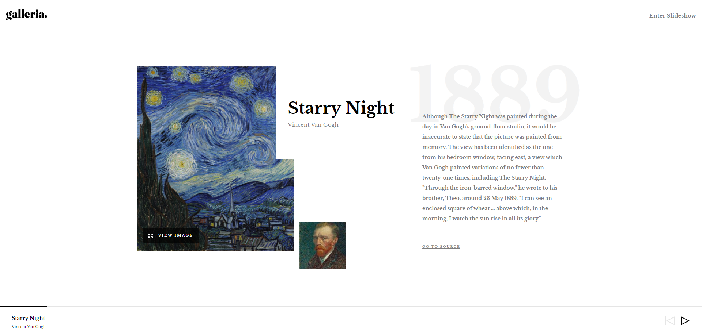

# Frontend Mentor - Galleria slideshow site solution

This is a solution to the [Galleria slideshow site challenge on Frontend Mentor](https://www.frontendmentor.io/challenges/galleria-slideshow-site-tEA4pwsa6).

## Overview

### The challenge

Users should be able to:

- View the optimal layout for the app depending on their device's screen size
- See hover states for all interactive elements on the page
- Navigate the slideshow and view each painting in a lightbox

### Screenshot





### Links

- [Solution URL](https://www.frontendmentor.io/solutions/galleria-site-created-with-react-typescript-scss-and-macyjs-wMxJ3cTcST):
- [Live Site URL](https://galleria-site-delta.vercel.app/):

## My process

### Built with

- Semantic HTML5 markup
- Flexbox
- CSS Grid
- Mobile-first workflow
- [React](https://reactjs.org/) - JS library
- [SCSS/SASS](https://sass-lang.com/) - For styles
- [Macy.js](http://macyjs.com/) - Masonry grid layout library
- [Framer Motion](https://www.framer.com/motion/) - Animation library


### What I learned


This project helped to me to understand how to use some React's more advanced hooks such as useReducer and useContext. With these React hooks, I created a global state that allowed to updating, removing and rendering UI elements on the website with ease. In addition, I learned how to use Framer Motion to add different animations to the site. I also used Macy.js to get the masonry effect on my Image container for the paintings. 

Two code fragments I would like to highlight: The first fragment takes all the reducer functions used throughout the website and putting them in a Context Provider so that any component in the website can access them if needed. Then the second code fragment breaks down the state and reducer functions that are passed into custom hooks for readiblity and sepearates the access into different methods.

```typescript
const useDetailsContext = (intialState: DetailsPageState):useDetailsContext => {
  const [state , dispatch] = useReducer(reducer , intialState);

  const updateIndex = useCallback((id: number) => dispatch({type:"SET_CURRENT_INDEX", payload: id}), []);
  const setSlide = useCallback(() => dispatch({type: "SET_CURRENT_SLIDE"}), []);
  const resetCurrentIndex = useCallback(()=> dispatch({type: "RESET_CURRENT_INDEX"}),[])

  const startSlideshow = ()=> {
      const num = setInterval(()=>{
        if(state.currentIndex + 1 > state.slides.length - 1){
          state.currentIndex = -1
        } 
        updateIndex(state.currentIndex += 1) 
      }, 5000)
      dispatch({type: "SET_SSID" , payload: num}) 
  }
  const stopSlideshow = ()=>{
    if(state.slideShowID !== 0){
      clearInterval(state.slideShowID);
      dispatch({type: "RESET_SSID"});
    }
  }
  return { state, updateIndex , setSlide , resetCurrentIndex,  startSlideshow, stopSlideshow };
}

const initalContextState: useDetailsContext = {
  state: INITIAL_STATE,
  updateIndex: (id: number) =>{},
  setSlide: () => {},
  resetCurrentIndex: () => {},
  startSlideshow: ()=>{},
  stopSlideshow: ()=>{}
}

export const DetailsContext = createContext<useDetailsContext>(initalContextState);

export const DetailsPageProvider = ({
  children
}: Children): ReactElement =>{
  return (
    <DetailsContext.Provider value={useDetailsContext(INITIAL_STATE)}>
      {children}
    </DetailsContext.Provider>
  )
}
```

```typescript

export const useDetails = () => {
  const { state } = useContext(DetailsContext);
  return { state }
}

export const useCurrentSlide = () => {
  const {state : { currentSlide, currentIndex }, setSlide, updateIndex } = useContext(DetailsContext);
  return { currentSlide, currentIndex, setSlide, updateIndex }
}

export const useSlideShow = () => {
  const { state : { slideShowID }, startSlideshow, stopSlideshow , resetCurrentIndex } = useContext(DetailsContext);
  return { slideShowID, startSlideshow, stopSlideshow, resetCurrentIndex }
}
```

### Continued development

In my future projects, if there is a need for a global state I will consider using this useContext + useReducer pattern again. For smaller global state this is a good alternative then using something like Redux-Toolkit which still is a great tool for state management. 

### Useful resources
- [useContext & useReducer](https://www.youtube.com/watch?v=05ZM4ymK9Nc) - This video helped me to understand how to use useReducer and useContext together with TypeScript. It also helped me to understand how to make a global state with these two React hooks.  


## Author
- Website - [Jameell Adjei](https://loquacious-torrone-f73fca.netlify.app/)
- Frontend Mentor - [@Jameell-Adjei](https://www.frontendmentor.io/profile/Jameell-Adjei)

